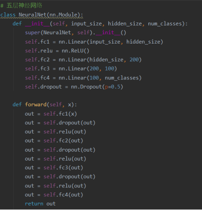
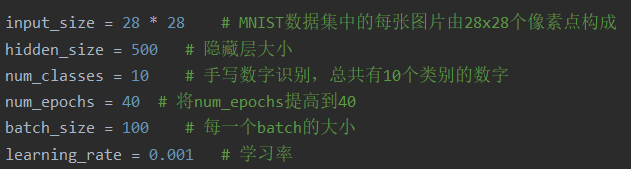
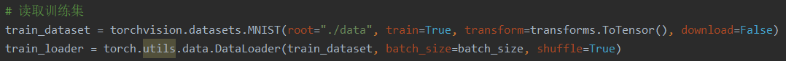
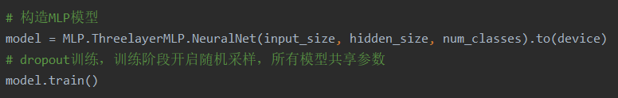
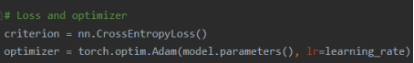
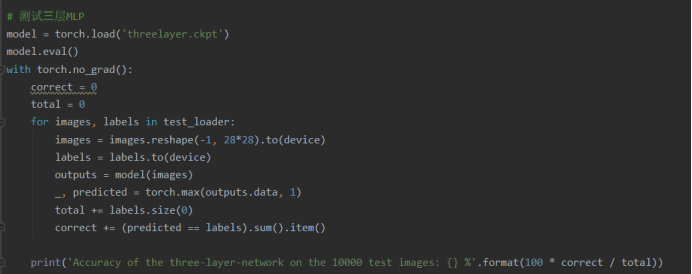

## Pytorch实现MLP并在MNIST数据集上验证

#### [1.综述](#1)

#### [2.MNIST数据集](#2)

#### [3.代码细节说明](#3)

#### [4.详细代码](#4)

<br/><br/><br/><br/><br/><br/>

<h3 id="1">综述</h3>

”PyTorch实现MLP并在MNIST数据集上验证“是我所上的模式识别与深度学习课程的第一个实验，主要是给我们练练手熟悉熟悉Pytorch的——如果你也是刚刚入门Pytorch，这个实验非常适合你来练手！

首先，介绍一下Pytorch：

- Pytorch是torch的python版本，是由Facebook开源的神经网络框架，专门针对 GPU 加速的深度神经网络（DNN）编程。Torch 是一个经典的对多维矩阵数据进行操作的张量（tensor ）库，在机器学习和其他数学密集型应用有广泛应用。与Tensorflow的静态计算图不同，pytorch的计算图是动态的，可以根据计算需要实时改变计算图。
- 关于Pytorch的使用教程，可以参考StarGAN的作者写的[Pytorch教程](https://github.com/yunjey/pytorch-tutorial)

<br/><br/><br/><br/>

<h3 id="2">MNIST数据集</h3>

```python
train_dataset = torchvision.datasets.MNIST(root="./data", train=True, transform=transforms.ToTensor(), download=True)
```

Pytorch中是可以直接使用上述语句下载MNIST数据集的，但是往往代码运行中这部分的下载十分缓慢（感谢我国著名建筑师方斌新院士）。解决办法是手动下载MNIST数据集，可以参考这篇文章[下载MNIST数据缓慢的方案](https://www.cnblogs.com/recoverableTi/p/12250622.html)

能够读取MNIST数据集后，我们便可以开始我们的具体实现了。

<br/><br/><br/><br/>

<h3 id="3">代码细节说明</h3>

本次实验代码主要由三个结构构成：用于训练的train.py、用于测试的test.py、用于存放MLP模型的MLP文件夹。程序执行的主体思路是：首先由train.py对构造的MLP模型在训练集上进行训练并保存相关的checkpoint，再由test.py读取checkpoint并在测试集上测试手写数字识别的准确率。

##### MLP模型（此处都使用了dropout训练）：

- 三层MLP模型：


- 四层MLP模型：


- 五层MLP模型：



<br/><br/>

**train.py：**

- 在train.py中，首先定义训练中需要用到的一些常量：



- 接着读取并构造训练集：



- 而后构造MLP模型（dropout训练，训练阶段开启随机采样，所有模型共享参数）：



- 并选择相应的loss函数以及优化算法，在此处我以交叉熵作为loss函数，并且选择了Adam(Adaptive moment estimation)算法作为优化算法：




- 最后，训练模型并保存：


<br/><br/>

##### test.py：

- 读取并构造测试集：


- 进行测试并输出：



<br/><br/>

至此，我们的代码实现细节就讲完了。

##### 最终代码运行结果：


<br/><br/><br/><br/>

<h3 id="4">详细代码</h3>

详细代码可见[详细代码](https://github.com/1170300513/Pattern-recognition-and-deep-learning/tree/master/深度学习实验/实验1/lab1code)

需要注意的是：我的Pytorch使用的是GPU版本，如果你安装的Pytorch是CPU版本的可能无法运行。另外，我把checkpoint也保存在其中了，如果各位懒得训练（迭代次数为40次，训练起来还是比较花费时间的）可以直接load我的checkpoint。

**原创不易，求赞求github打星！**