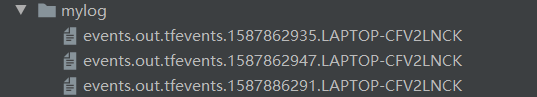
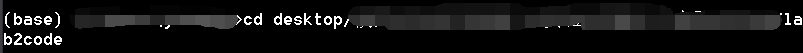
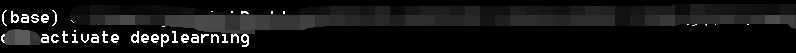
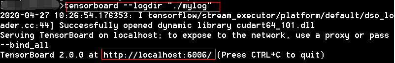
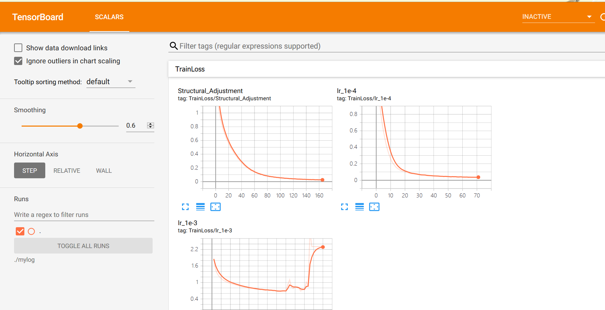

## （深度学习）Pytorch进阶之实现AlexNet

### [1.综述](#1)

### [2.数据集](#2)

### [3.代码细节说明](#3)

### [4.训练数据可视化](#4)

### [5.详细代码](#5)

<br/>

<br/><br/><br/><br/><br/>

<h3 id = "1">综述</h3>

这是Pytorch深度学习系列的第二个项目。

在上一篇文章[Pytorch实现MLP并在MNIST数据集上验证](https://blog.csdn.net/junbaba_/article/details/105670088)文章中，我们实现了一个基础的神经网络。这次，我们要更进一步，实现一个CNN（卷积神经网络）——AlexNet。

2012 年，Alex 等人提出的 AlexNet 网络在 ImageNet 大赛上以远超第二名的成绩夺冠，卷积神经网络乃至深度学习重新引起了广泛的关注。AlexNet 是在 LeNet 的基础上加深了网络的结构，学习更丰富更高维的图像特征。AlexNet 的特点：

-   更深的网络结构
-   使用层叠的卷积层，即卷积层+卷积层+池化层来提取图像的特征
-   使用 Dropout 抑制过拟合
-   使用数据增强 Data Augmentation 抑制过拟合
-   使用 Relu 替换之前的 sigmoid 的作为激活函数
-   多 GPU 训练

<br/><br/><br/><br/>

<h3 id = "2">数据集</h3>

本次使用的数据集为CIFAR-10数据集，官网上可能下载较慢，可以在[https://pan.baidu.com/s/1bGVGeeiw001qz-PUk7q1Uw](https://pan.baidu.com/s/1bGVGeeiw001qz-PUk7q1Uw)（提取码：m35y）中下载python版本的数据集。

数据集存放在根目录下data目录中，结构如下:

```markdown
data
 └── cifar-10-batches-py
```

另外，虽然`torchvision.datasets.CIFAR10`中已经可以直接调用CIFAR10，但在本次项目中，我还是自己实现了一个解析CIFAR-10数据集的类。

<br/><br/><br/><br/>

<h3 id = "3">代码细节说明</h3>

本次代码主要由四个结构构成：用于训练的 train.py、用于测试的 test.py、用于构造 AlexNet 模型的 Alexnet.py 以及用于构造自己的 CIFAR-10 数据集的MyCIFAR10.py。程序执行的主体思路是：首先由 train.py 对构造的 AlexNet 模型在训练集上进行训练并保存相关的 checkpoint，再由 test.py 读取 checkpoint 并在测试集上测试手写数字识别的准确率。

##### Alexnet.py：

我所构造的 Alexnet,参考了 torchvision.models.alexnet，并做出了以下改变：

- 在 Conv2d 层中就卷积核大小、步长、填充长度进行了改变。
- 在池化层中改变了卷积核大小，避免后续图片过小。
- 删除了 avgpool。

```python
def __init__(self, num_classes=10):
    super(Alexnet, self).__init__()
    # 卷积层
    self.features = nn.Sequential(
        nn.Conv2d(3, 64, kernel_size=3, stride=1, padding=1),  # 缩小卷积核，步长、填充
        nn.ReLU(inplace=True),  # inplace=True，覆盖操作，节省空间
        # nn.MaxPool2d(kernel_size=2),  # 32 -> 16
        nn.Conv2d(64, 192, kernel_size=3, stride=1, padding=1),
        nn.ReLU(inplace=True),
        nn.MaxPool2d(kernel_size=2),  # 32 -> 16
        nn.Conv2d(192, 384, kernel_size=3, stride=1, padding=1),
        nn.ReLU(inplace=True),
        nn.Conv2d(384, 256, kernel_size=3, stride=1, padding=1),
        nn.ReLU(inplace=True),
        nn.Conv2d(256, 256, kernel_size=3, stride=1, padding=1),
        nn.ReLU(inplace=True),
        nn.MaxPool2d(kernel_size=2),  # 16 -> 8
    )
    self.avgpool = nn.AdaptiveAvgPool2d((4, 4))  # 8 -> 4
    # 全连接层
    self.classifier = nn.Sequential(
        nn.Dropout(),
        nn.Linear(256 * 4 * 4, 4096),
        nn.ReLU(inplace=True),
        nn.Dropout(),
        nn.Linear(4096, 4096),
        nn.ReLU(inplace=True),
        nn.Linear(4096, num_classes),
    )
```

<br/><br/>

**MyCIFAR10.py：**

详细原理可以参照我的这篇文章：[（深度学习）构造属于你自己的Pytorch数据集](https://blog.csdn.net/junbaba_/article/details/105740713)

`torch.utils.data.DataLoader` 不仅生成迭代数据非常方便，而且它也是经过优化的，效率十分之高（肯定比我们自己写一个要高多了），因此最好不要舍弃。因此，我的想法是根据 CIFAR-10 数据集构造一个 Dataset 的子类，使之能够作为`torch.utils.data.DataLoader` 的参数，从而使数据集能被我们用于生成迭代数据进行训练与测试。

```python
class MyCIFAR10(Dataset):
    """
    根据CIFAR-10定义的个人数据集类
    继承自Dataset类，因此能够被torch.utils.data.DataLoader使用，从而更高效地在训练和测试中迭代
    """

    def __init__(self, root, train=True, transform=None, target_transform=None):
        super(MyCIFAR10, self).__init__()
        self.transform = transform
        self.target_transform = target_transform
        self.imgs = None
        self.labels = []

        # 根据CIFAR-10官网上下载的数据，训练集分为5个batch文件，每个里有10000张32*32的图片；测试集只有1个batch文件，里面有10000张32*32的图片
        train_lists = ['data_batch_1',
                       'data_batch_2',
                       'data_batch_3',
                       'data_batch_4',
                       'data_batch_5']
        test_lists = ['test_batch']

        # 根据train是否为True来选择测试集或训练集
        if train:
            lists = train_lists
        else:
            lists = test_lists

        # 读取数据集，构造类中的图像集和标签
        for list in lists:
            filename = os.path.join(root, list)
            with open(filename, 'rb') as f:  # 这里需要'rb' + 'latin1'才能读取
                datadict = pickle.load(f, encoding='latin1')
                X = datadict['data'].reshape(-1, 3, 32, 32)
                Y = datadict['labels']
                if self.imgs is None:
                    self.imgs = np.vstack(X).reshape(-1, 3, 32, 32)
                else:
                    self.imgs = np.vstack((self.imgs, X)).reshape(-1, 3, 32, 32)
                self.labels = self.labels + Y
        self.imgs = torch.from_numpy(self.imgs).type(torch.FloatTensor)

    # 继承的Dataset类需要实现两个方法之一：__getitem__(self, index)
    def __getitem__(self, index):
        img, label = self.imgs[index], self.labels[index]

        # img = Image.fromarray(img)
        # img = torch.from_numpy(img).type(torch.FloatTensor)

        if self.transform is not None:
            img = self.transform(img)

        if self.target_transform is not None:
            label = self.target_transform(label)

        return img, label

    # 继承的Dataset类需要实现两个方法之一：__len__(self)
    def __len__(self):
        return len(self.imgs)
```

<br/><br/>

**train.py：**

首先，定义一个解析命令行参数的函数，使得我们能够通过命令行输入一些训练时需要的关键常量，便于我们进行调参：

```python
def get_args():
    """
    解析命令行参数
    返回参数列表
    """
    parser = OptionParser()
    parser.add_option('-e', '--epochs', dest='epochs', default=20, type='int',
                      help='number of epochs')
    parser.add_option('-b', '--batch_size', dest='batchsize', default=50,
                      type='int', help='batch size')
    parser.add_option('-l', '--lr', dest='lr', default=3e-4,
                      type='float', help='learning rate')
    (options, args) = parser.parse_args()
    return options
```

构造训练集是用上了自己定义 MyCIFRA10 类：

```python
# 构造训练集
cifar10 = MyCIFAR10.MyCIFAR10('./data/cifar-10-batches-py', train=True)
train_loader = torch.utils.data.DataLoader(dataset=cifar10, batch_size=batch_size, shuffle=True)
```

 剩下的训练部分都很常规，和上一篇文章的步骤基本相似，并且在代码中注释详尽，这里就不赘述了。主要讲一下改进的一些部分：

- 每一个 epoch 计算一次平均 loss，并进行可视化绘画(`from tensorboardX import SummaryWriter`)：

```python
    # 每个epoch计算一次平均Loss
    print('Epoch [{}/{}], Loss: {:.4f}'.format(epoch + 1, epochs, trainloss / len(train_loader)))
    # write to tensorboard
    writer.add_scalar('scalar/TrainLoss', trainloss/len(train_loader), epoch, walltime=epoch)
writer.close()
```

- 添加了异常，使得按下 Ctrl+C 打断训练后，能保存模型：

```python
# ctrl + C 可停止训练并保存
except KeyboardInterrupt:
    print("Save.....")
    torch.save(model.state_dict(), os.path.join('./checkpoints', 'Interrupt.ckpt'))
    exit(0)
return model
```

<br/><br/>

**test.py：**

关闭 dropout 开启测试模式：

```python
# 关闭dropout开启测试模式
model.eval()
```

测试准确度并输出：

```python
# 测试准确度
with torch.no_grad():
    correct = 0
    total = 0
    Loss = 0.0
    for images, labels in test_loader:
        # 若GPU可用，拷贝数据至GPU
        images = images.to(device)
        labels = labels.to(device)
        # 将图像输入Alexnet中并得到结果
        outputs = model(images)
        # 如果需要展示Loss，就计算并累加
        if showloss:
            loss = criterion(outputs, labels)
            Loss += loss
        # 获得概率最大的下标，即分类结果
        _, predicted = torch.max(outputs.data, 1)
        # 计算正确个数
        total += labels.size(0)
        correct += (predicted == labels).sum().item()
    # 如果需要展示Loss，则打印出Loss
    if showloss:
        print('Loss in test_loader: {:.4f}'.format(Loss / len(test_loader)))
    # 打印测试准确率
    print('Accuracy of the network on the {} test images: {} %'.format(len(images) * len(test_loader),
                                                                       100 * correct / total))
```

<br/><br/><br/><br/>

<h3 id = "4">训练数据可视化</h3>

在前面的代码细节中，我们使用了tensorboardX（假定你已经下载好了tensorboardX，如果未下载好，可以在环境中配置tensorboardX）进行训练数据可视化，最终在项目文件中留下：



需要使用tensorboard对其进行可视化展示（假定你已经下载好了tensorboard，如果未下载好，可以在环境中配置tensorflow）。

我这里使用的是Anaconda Prompt，进入到mylog所在的目录中：



切换安装了tensorboard的环境：



输入命令：

```markdown
tensorboard --logdir "./mylog"
```



用浏览器进入下方红框中的网址即可查看绘图：



如果浏览器打开空白页面，可以参考我这篇文章[tensorboard命令打开空白页面的解决办法](https://pan.baidu.com/s/1bGVGeeiw001qz-PUk7q1Uw)的解决方案。

<br/><br/><br/><br/>

<h3 id = "5">详细代码</h3>

详细代码可见：[详细代码](https://github.com/1170300513/Pattern-recognition-and-deep-learning/tree/master/深度学习实验/实验2/lab2codecommit)

这次的checkpoint文件有点大，git上传花费我好大精力研究。数据集我没有上传，目录结构可以看前文的[数据集](#2)。